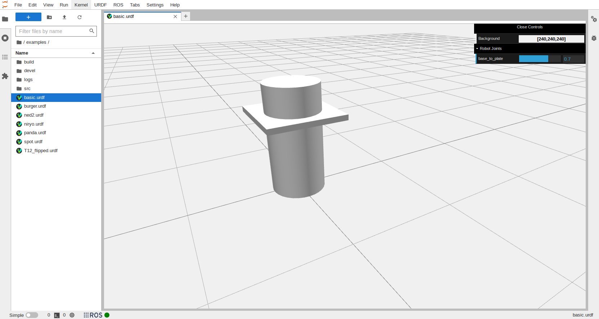
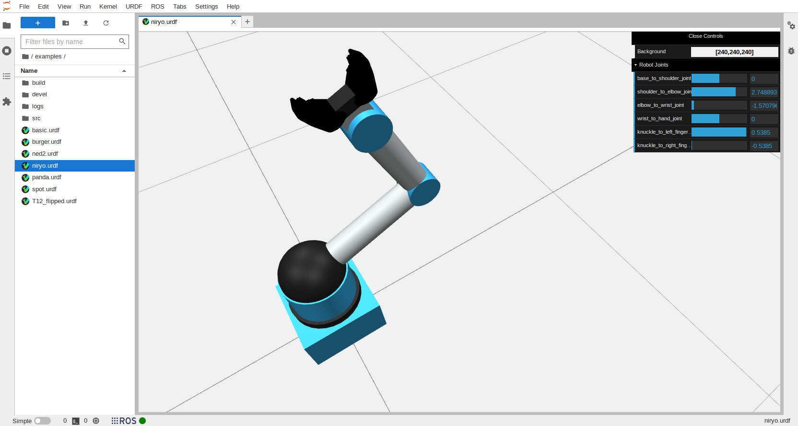
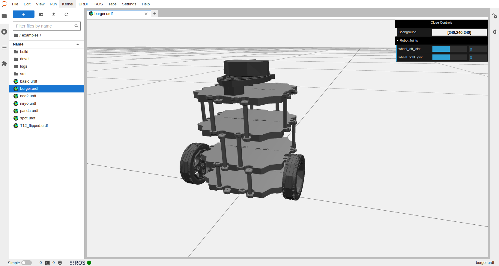
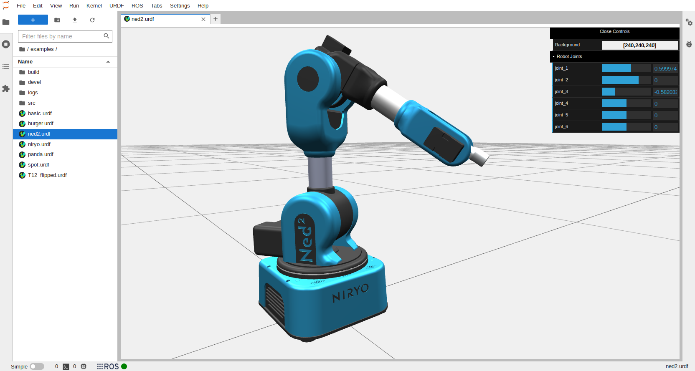
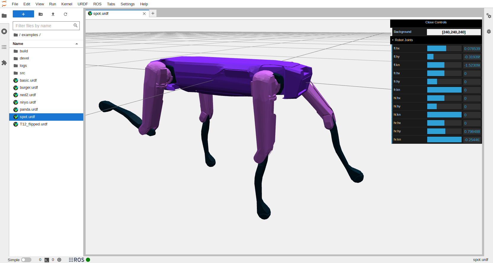
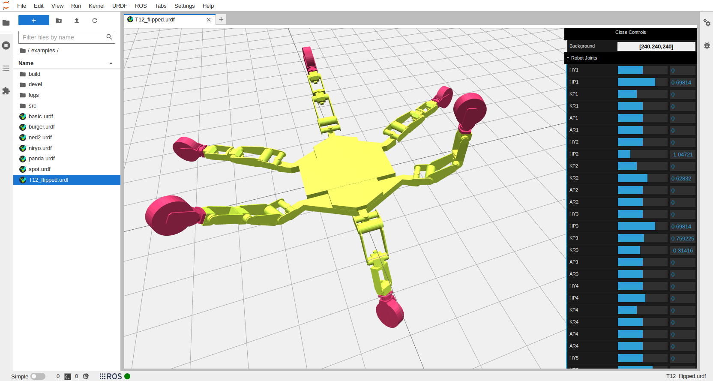

# Examples

Without any configuration, the basic robot example can be displayed in the viewer. This robot is simmply two geometric components with a single prismatic joint.

To display the basic Niryo and the Burger robot, a ROS environment needs to be configured accordingly in order for the viewer to locate the necessary mesh files. The following ROS packages are required:

- `ros-noetic-urdf-tutorial`
- `ros-noetic-turtlebot3-description`

Similarly, Ned, Spot and the T12 robot use robot description ROS packages to store their respective mesh files. These packages will need to be installed locally and the ROS environment configured correctly (`source <workspace>/devel/setup.bash`) so that these packages can be accessed.

- `ned_description`
- `spot_description`
- `t12_description`

