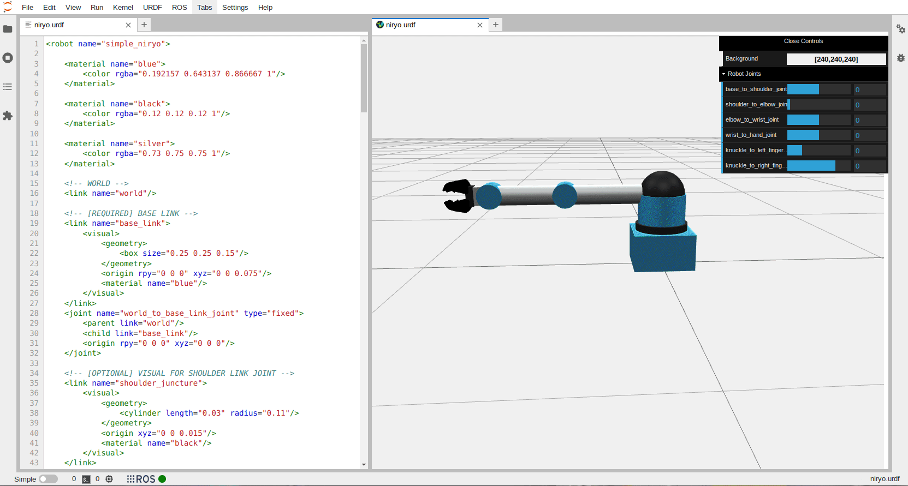

.. jupyterlab-urdf documentation master file, created by
   sphinx-quickstart on Mon Jul  4 13:37:31 2022.
   You can adapt this file completely to your liking, but it should at least
   contain the root `toctree` directive.

Welcome to jupyterlab-urdf's documentation!
===========================================

With this JupyterLab extension, you can easily create and modify URDF files from the comfort of your web browser.

.. toctree::
   :maxdepth: 2
   :caption: Contents:

   installation

.. toctree::
   :maxdepth: 2
   :caption: Usage:

   urdf_editor
   urdf_viewer
   examples

Indices and tables
==================

* :ref:`genindex`
* :ref:`modindex`
* :ref:`search`
