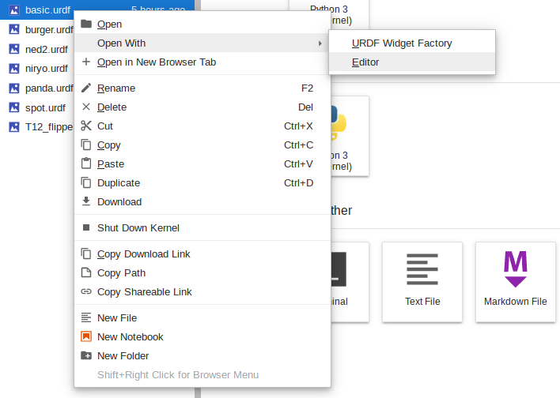
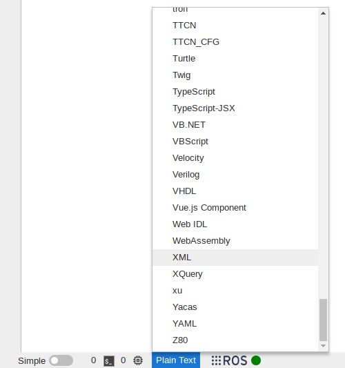

# URDF Editor

To open the text editor for any URDF file, simply right click on the file and select "Open With" > "Editor".

Once the file is open, syntax highlighting can be enabled by selecting "XML" from the language menu in the bottom left corner.

