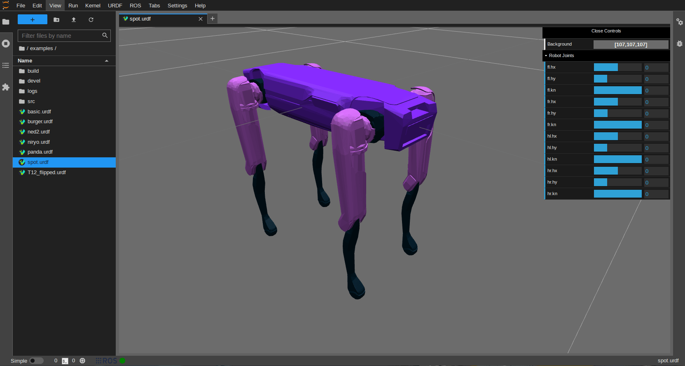

# URDF Viewer

The simplest way to open the viewer is by double clicking on any already existing URDF file from the File Browser. New files can also be created from the top menu or from the launcher.

With the URDF editor open, files can be modified directly and the changes will be immediately reflected in the viewer.

**Note:** if the URDF file contains too many errors or incomplete lines, the viewer will not be able to display the robot and thus the viewer will have to be reloaded.

The viewer provides a control panel to manually modify the joint positions. The changes are only reflected in the viewer and are not saved to the URDF file.

Only revolute and prismatic joints will be included in the panel, fixed joints are automatically ignored. If the joints have upper and lower limits, those will become the limits of the joint slider, otherwise a default range will appear.
