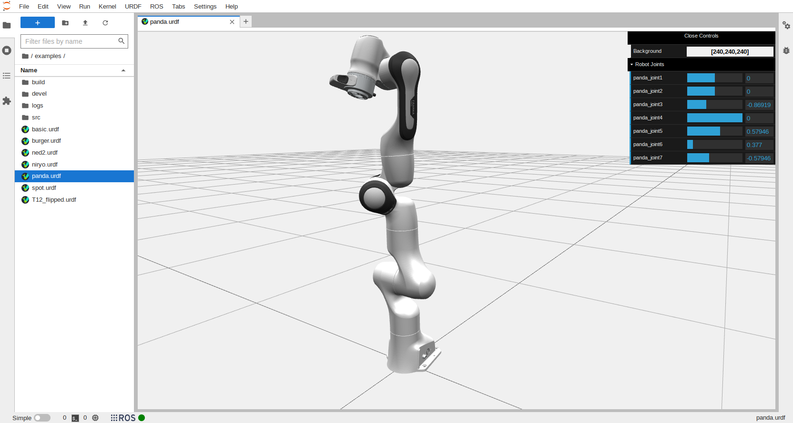

Examples
========

Basic Robot
-----------

This robot is simply two geometric components with a single prismatic joint.

.. image:: _static/exBasic.png
    :alt: Basic robot, a cylinder and plate, shown in viewer

Niryo
-----

The examples include a simplified version of Niryo which links a mesh file to
create the gripping mechanism.

.. image:: _static/exNiryo.png
    :alt: Simplified Niryo robot shown in viewer

.. note::
    The *Path* is relative to the directory where JupyterLab is launched from. 
    When modifying, this path should point to the location of the robot
    description packages containing the mesh files. In this case, the path is
    by default set to */examples* because this is the parent directory of the
    robot description packages.

.. image:: _static/exNed2.png
    :alt: Ned 2 robot shown in viewer

Spot
----

.. image:: _static/exSpot.png
    :alt: Spot robot shown in viewer

Panda
-----

Xacro files are also supported. However, it is not (yet) possible to search for
packages with ``$(find robot_description)``. 

T12
---

.. image:: _static/exT12.png
    :alt: T12 robot shown in viewer
