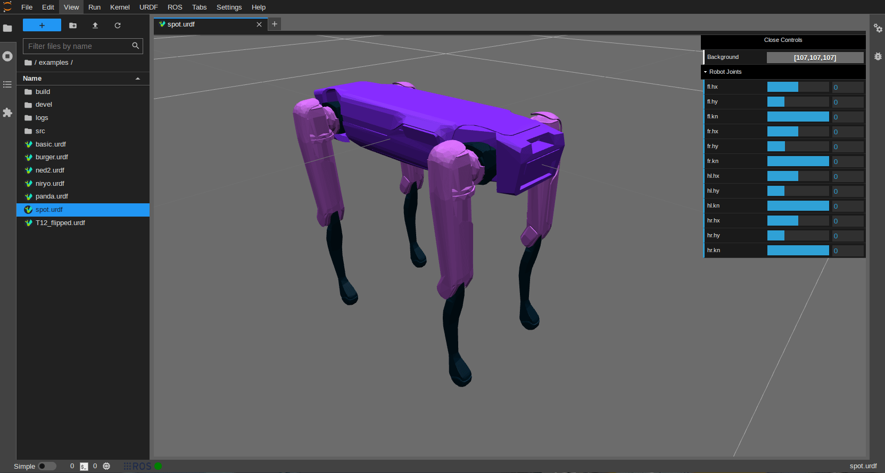
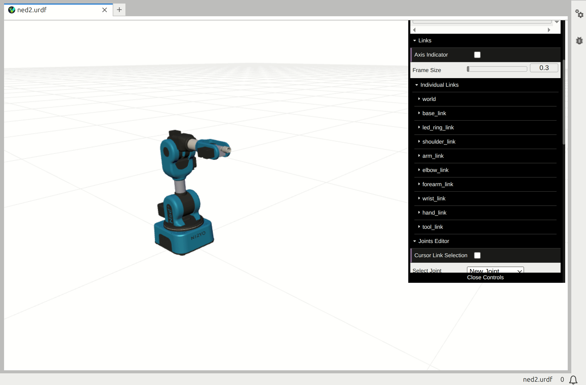
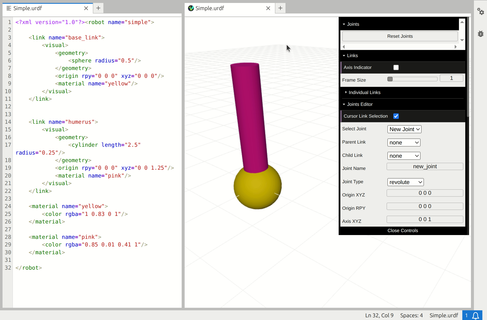

URDF Viewer
===========

The simplest way to open the viewer is by double clicking on any already 
existing URDF file from the File Browser. New files can also be created from the
top menu or from the launcher.

With the URDF editor open, files can be modified directly and the changes will 
be immediately reflected in the viewer.

.. image:: _static/urdfEditor.gif
    :alt: URDF live editor gif

The viewer provides a control panel to manually modify the joint positions. 

.. note::
    The changes are only reflected in the viewer and are not saved to the URDF
    file.

Only revolute and prismatic joints will be included in the panel, fixed joints 
are automatically ignored. Each joint must have upper and lower joint limits to
be displayed on the control panel.

The opacity of each link can be controlled and their frames can be toggled on/off.

Joints can be added and modified from the Joints Editor folder in the controls panel.
To add a new joint, select the parent link and the child link from either the 3D viewer
or the drop down menu, then choose the joint type and its properties and click "Add Joint".

